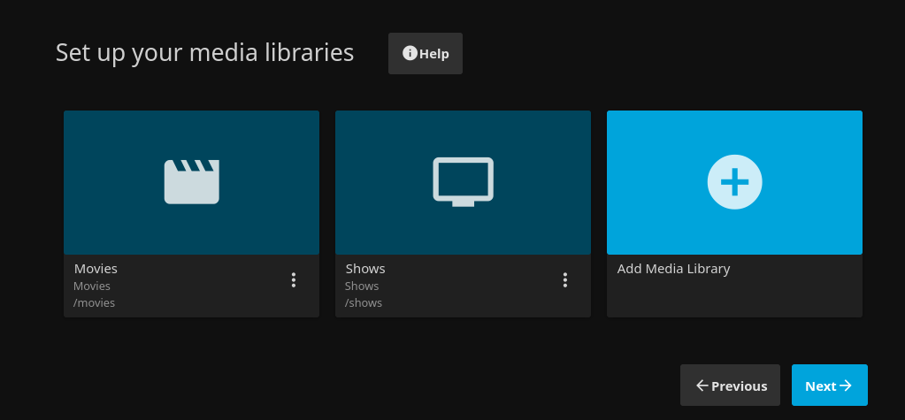
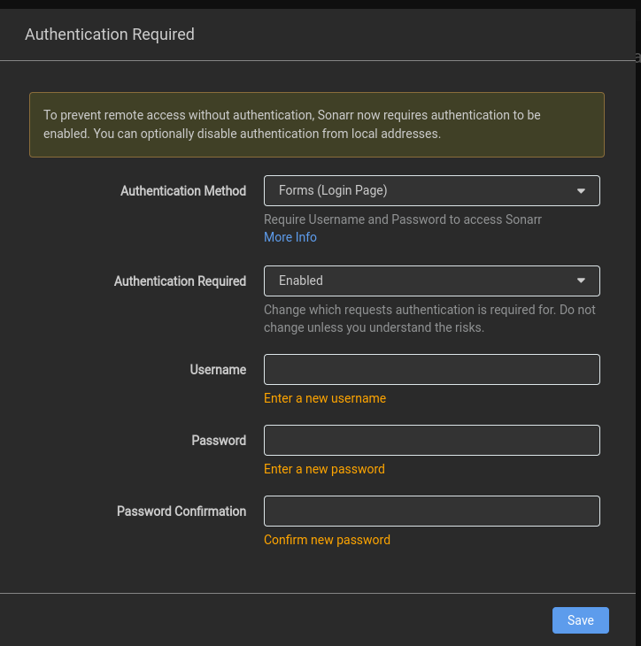

## Nastavení media stacku pomocí Docker Compose
- Tento Docker Compose nám nainstaluje a správně nastaví všechny služby potřebné pro **home-streaming server**
- Pomocí služeb `Jellyseer` a jeho podslužeb `Radarr` a `Sonarr`, můžeme automaticky zažádat o film/serial a tyto služby nám najdou s případně stáhnou potřebné soubory pro sledování v **Jellyfin**u

## Odkazy na všechny služby
- Radarr: [http://localhost:7878](http://localhost:7878)
- Sonarr: [http://localhost:8989](http://localhost:8989)
- Prowlarr: [http://localhost:9696](http://localhost:9696)
- qBittorrent: [http://localhost:8080](http://localhost:8080)
- Jellyseer[http://localhost:5055](http://localhost:5055)
- Jellyfin [http://localhost:8096](http://localhost:8096)

## Instalace

- Před spuštěním compose je potřeba si připravit a porozumět struktůře jako je potřeba mít

```
/mnt/media/
├── downloads
├── movies
└── shows
```
- `Downloads`: Mezi složka pro stahování souboru než se nám automaticky přesunout
- `Movies`: Zde se nám pak budou vkládat **filmy**
- `Shows`: Zde se nám pak budou vkládat **seriály**

```
/opt/media-stack/
├── downloads
├── i2pd
├── jackett
├── jellyfin
├── jellyseerr
├── prowlarr
├── qbittorrent
├── radarr
├── recyclarr
└── sonarr
```
- A takto vypadá naše složka v `/opt/media-stack`, zde nalezneme všechny konfigurační soubory ke všem službám. Tak můžeme jednoduše všechny vykopírovat a přesunout konfiguraci na jiný server.

Proto musíme v compose vložit korektní cesty k naším složkám. Stačí pochopit jak se linkují složky do hosta z kontejneru
```bash
host_slozka:kontejner_slozka
```
- Musíme pro Sonarr, Radarr, Jellyfin, qBittorrent nastvit správne odkazy na složky
- Pokud se jedná o **configy** měli bychom nechat cestu do `/opt` není třeba nic vytvářet všechny podsložky a soubory se vytvoří automaticky!

```yml
services:
  jellyfin:
    image: jellyfin/jellyfin
    container_name: jellyfin
    volumes:
        - /opt/media-stack/jellyfin/config:/config
        - /opt/media-stack/jellyfin/cache:/cache
        - /mnt/media/movies:/movies
        - /mnt/media/shows:/shows
    restart: unless-stopped
    ports:
        - 8096:8096
    networks:
        - media-network

  jellyseerr:
    image: fallenbagel/jellyseerr:latest
    container_name: jellyseerr
    environment:
      - LOG_LEVEL=debug
      - TZ=Europe/Prague
      - PORT=5055
    ports:
      - 5055:5055
    volumes:
      - /opt/media-stack/jellyseerr:/app/config
    restart: unless-stopped
    networks: 
      - media-network

  radarr:
    image: lscr.io/linuxserver/radarr:latest
    container_name: radarr
    environment:
      - PUID=1000
      - PGID=1000
      - TZ=Europe/Prague
    volumes:
      - /opt/media-stack/radarr/data:/config
      - /mnt/media/movies:/movies
      - /opt/media-stack/downloads:/downloads
    ports:
      - 7878:7878
    restart: unless-stopped
    networks:
      - media-network

  sonarr:
    image: lscr.io/linuxserver/sonarr:latest
    container_name: sonarr
    environment:
      - PUID=1000
      - PGID=1000
      - TZ=Europe/Prague
    volumes:
      - /opt/media-stack/sonarr/data:/config
      - /media/media/shows:/tv
      - /opt/media-stack/downloads:/downloads
    ports:
      - 8989:8989
    restart: unless-stopped
    networks:
      - media-network

  prowlarr:
    image: lscr.io/linuxserver/prowlarr:latest
    container_name: prowlarr
    environment:
      - PUID=1000
      - PGID=1000
      - TZ=Europe/Prague
    volumes:
      - /opt/media-stack/prowlarr/data:/config
    ports:
      - 9696:9696
    restart: unless-stopped
    networks:
      - media-network

  flaresolverr:
    image: ghcr.io/flaresolverr/flaresolverr:latest
    container_name: flaresolverr
    ports:
      - "8191:8191"
    environment:
      - LOG_LEVEL=info
    restart: unless-stopped
    networks:
      - media-network

  qbittorrent:
    image: lscr.io/linuxserver/qbittorrent:latest
    container_name: qbittorrent
    privileged: true
    environment:
      - PUID=1000
      - PGID=1000
      - TZ=Europe/Prague
      - WEBUI_PORT=8080
    volumes:
      - /opt/media-stack/qbittorrent/config:/config
      - /opt/media-stack/downloads:/downloads
    ports:
      - 8080:8080
      - 6881:6881
      - 6881:6881/udp
    restart: unless-stopped
    networks:
      - media-network

networks: 
  media-network: 
    driver: bridge
```

## Nastavení
### Jellyfin
- Půjdeme na stránku [http://localhost:8096](http://localhost:8096) a projedem wizard.

- Když se dostaneme na část wizardu kde máme nasměrovat Jellyfin na naše media složky tak Movies mají `/movies` a Shows mají `/shows`

- A zbytek nastavíme podle své libosti

### qBittorrent
- Půjdeme na stránku [http://localhost:8080](http://localhost:8080) a půjdeme do logů našeho qBittorent kontejneru a tam najdeme automaticky vygenerované heslo co si musíme přenastavit
```bash
docker logs qbittorrent
```

- A přihlásime
- A půjdeme do  Webového UI a půjdeme do Tools -> Options -> WebUI -> Authentication
- A nastavíme svoje heslo a uživatelské jméno kdybychom si to nenastavili tak se to každým restartem bude měnit
- **NEZAPOMENEME ULOŽIT**

### Sonarr
- Půjdeme na stránku [http://localhost:8989](http://localhost:8989) a provedeme toto nastavení

**Authentication Method**: Form (Login Page) \
**Username**: <vlastni_login> \
**Password**: <vlastni_heslo> \
**Password Confirmation**: <vlastni_heslo_znovu> 



#### Nastavení
- Settings -> Media Management a vybereme `Show Advanced`

1. Zaklikneme `Sonarr will use the existing file name if renaming is disabled`
2. [Formattování epizod](https://trash-guides.info/Sonarr/Sonarr-recommended-naming-scheme/#optional-jellyfin)
- Standard Episode Format
```
{Series TitleYear} - S{season:00}E{episode:00} - {Episode CleanTitle} [{Custom Formats }{Quality Full}]{[MediaInfo VideoDynamicRangeType]}{[Mediainfo AudioCodec}{ Mediainfo AudioChannels]}{[MediaInfo VideoCodec]}{-Release Group}
```
- Daily Episode Format
```
{Series TitleYear} - {Air-Date} - {Episode CleanTitle} [{Custom Formats }{Quality Full}]{[MediaInfo VideoDynamicRangeType]}{[Mediainfo AudioCodec}{ Mediainfo AudioChannels]}{[MediaInfo VideoCodec]}{-Release Group}
```
- Anime Episode Format
```
{Series TitleYear} - S{season:00}E{episode:00} - {absolute:000} - {Episode CleanTitle} [{Custom Formats }{Quality Full}]{[MediaInfo VideoDynamicRangeType]}[{MediaInfo VideoBitDepth}bit]{[MediaInfo VideoCodec]}[{Mediainfo AudioCodec} { Mediainfo AudioChannels}]{MediaInfo AudioLanguages}{-Release Group}
```
- Series Folder Format
```
{Series TitleYear} [tvdbid-{TvdbId}]
```
- Season Folder Format
```
Season {season:00}
```
- Multi Episode Style
```
Prefixed Range
```
3. **NEZAPOMENE ULOŽIT**


### Radarr
- Půjdeme na stránku [http://localhost:7878](http://localhost:7878) a provedeme nastavení jako u Sonarru

**Authentication Method**: Form (Login Page) \
**Username**: <vlastni_login> \
**Password**: <vlastni_heslo> \
**Password Confirmation**: <vlastni_heslo_znovu> 

- Settings -> Media Management a vybereme `Show Advanced`

1. Zaklikneme `Radarr will use the existing file name if renaming is disabled`
2. [Formátování filmů](https://trash-guides.info/Radarr/Radarr-recommended-naming-scheme/#optional-jellyfin)
- Standard Movies Format
```
{Movie CleanTitle} {(Release Year)} [imdbid-{ImdbId}] - {Edition Tags }{[Custom Formats]}{[Quality Full]}{[MediaInfo 3D]}{[MediaInfo VideoDynamicRangeType]}{[Mediainfo AudioCodec}{ Mediainfo AudioChannels]}{[Mediainfo VideoCodec]}{-Release Group}
```
- Movie Foldeer Format
```
{Movie CleanTitle} ({Release Year}) [tmdbid-{TmdbId}]
```
3. **ULOŽÍME**

### Prowlarr
- Půjdeme na stránku [http://localhost:9696](http://localhost:9696) a provedeme nastavení jako u Sonarru a Radaru

**Authentication Method**: Form (Login Page) \
**Username**: <vlastni_login> \
**Password**: <vlastni_heslo> \
**Password Confirmation**: <vlastni_heslo_znovu> 

- Pak zajdeme Settings -> Apps a přídáme dvě aplikace to Radarr a Sonarr
#### Radarr

1. Sync Level
```
Full Sync
```
2. Prowlarr Server
Jelikož to máme v jednom docker stacku a v jedné síti můžeme použít místo IP jen název kontejneru

```
http://prowlarr:9696
```
3. Radarr Server
```
http://radarr:7878
```

4. API Key
Zajdeme do našeho [Radarru](http://localhost:7878) a jdeme do `Settings -> General` a tam si vykopírujeme API key

5. A dáme `Test` a pokud vše proběhne dáme `Save`

#### Sonarr 

1. Sync Level
```
Full Sync
```
2. Prowlarr Server
Jelikož to máme v jednom docker stacku a v jedné síti můžeme použít místo IP jen název kontejneru

```
http://prowlarr:9696
```
3. Sonarr Server
```
http://sonarr:7878
```

4. API Key
Zajdeme do našeho [Sonarr](http://localhost:8989) a jdeme do `Settings -> General` a tam si vykopírujeme API key

5. A dáme `Test` a pokud vše proběhne dáme `Save`

#### qBittorrent
- PŮjdeme do Settings -> Download Clients a přidáme qBittorrent

1. Název si dáme jaký chceme
2. Zaškrtneme `Enable`
3. Host
```
qbittorrent
```
4. Port
```
8080
```
5. Username dáme jako přihlašovací jméno do qBittorrentu
6. A to sáme jak v kroku pět uděláme to samé pro Password
7. Otestujeme a uložíme

#### FlareSolverr
- PŮjdeme do Settings -> Indexers a přidáme nový FlareSolverr
1. Name
```
Flaresolverr
```
2. Tags
```
flaresolverr
```
3. Host
```
http://flaresolverr:8191/
```
